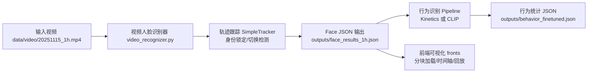

# 课堂行为分析系统

智能课堂行为分析系统，支持视频人脸识别、学生轨迹跟踪、行为识别与统计分析。

## 🎯 主要特性

- **两阶段处理流程**：人脸识别与行为识别完全解耦，提高灵活性
- **鲁棒轨迹跟踪**：Body bbox辅助跟踪，低头场景保持连续性
- **智能身份锁定**：多帧加强识别、滞回状态机、身份切换检测
- **零样本行为识别**：支持CLIP模型自定义行为类别
- **完整时间线记录**：从首次出现到最后消失，包含未识别阶段

## 🚀 快速开始

### 环境安装

本项目推荐使用 `uv` 管理 Python 环境（可选），也可以直接使用系统 Python + `pip`。

使用 `uv`（推荐）：

```bash
apt-get install pipx
pipx ensurepath
pipx install uv

# 安装项目依赖（默认）
uv sync

# 如果希望安装开发组依赖：
uv sync --group dev
```

如果不使用 `uv`，可直接安装依赖：

```bash
pip install -r requirements.txt
```

### 人脸识别

```bash
python video_recognizer.py data/video/20251115_1h.mp4 \
    --output-json outputs/face_results_1h.json \
    --gallery data/id_photo \
    --interval-frames 10 \
    --enable-person-detection
```

**输出**：包含人脸和body bbox的JSON文件

### 行为识别

```bash
python behavior_analyzer.py \
    --face-json outputs/face_results.json \
    --video data/video/20251115_clip.mp4 \
    --output-json outputs/behavior_stats.json \
    --model-type clip
```

**输出**：行为统计JSON文件

使用人体识别增强的行为识别：
```bash
python behavior_analyzer.py \
    --face-json outputs/face_results_1h.json \
    --video data/video/20251115_1h.mp4 \
    --person-detector models/yolo11n_classroom_context/weights/best.pt \
    --output-json outputs/behavior_finetuned.json
```

### 使用GPU服务器推理

首先将项目打包：
```bash
tar -zcvf behavior.tar.gz --exclude=".git" --exclude="./.ruff_cache" --exclude="./outputs" --exclude="./.venv" ./
```

然后将 `behavior.tar.gz` 上传到GPU服务器，解压后安装依赖并运行：

```bash
tar -zxvf behavior.tar.gz
uv sync  # 或 pip install -r requirements.txt
```

然后按照前述命令运行人脸识别和行为识别。

## 📚 文档

- [开发环境指南](./docs/DEV_ENVIRONMENT.md) - 根据不同的设备，配置开发环境的说明
- [CLIP使用指南](./docs/CLIP_USAGE.md) - 如何使用CLIP模型进行行为识别
- [YOLO身体框识别模型](./docs/YOLO_finetune_for_context.md) - 如何微调YOLO模型进行身体框识别
- [前端系统](./fronts/README.md) - 基于 React 的课堂行为分析前端系统
- [研究报告](./docs/RESEARCH_REPORT.md) - 项目研究背景、方法、实验结果与分析

## 模型下载

### 图像检测模型
`yolo11n` 检测模型（`yolo11n.pt`）会在模块首次运行时自动下载到当前工作目录下。若下载速度过慢，请设置代理或手动下载：

```bash
export HTTP_PROXY="xxx"
export HTTPS_PROXY="xxx"
```

### 人脸识别模型
项目使用 `insightface` 的 `buffalo_l` 模型，会在首次运行时自动下载到 `~/.insightface/model`。若下载缓慢，可手动下载并解压到该目录：

```bash
# 使用镜像源下载
wget "https://gh-proxy.org/https://github.com/deepinsight/insightface/releases/download/v0.7/buffalo_l.zip"
mv buffalo_l.zip ~/.insightface/model/
cd ~/.insightface/model/
unzip buffalo_l.zip -d buffalo_l
rm buffalo_l.zip
```

## 中文字体异常

在部分 Ubuntu 系统中可能缺失中文字体，导致可视化图片中的中文标签乱码。可安装常用中文字体包以解决：

```bash
sudo apt update
sudo apt install -y fonts-noto-cjk fonts-wqy-zenhei fonts-wqy-microhei fonts-arphic-ukai fonts-arphic-uming
```

## 🏗️ 架构概览


- 输入视频经人脸识别与轨迹跟踪生成 Schema v2 的 Face JSON（包含 body bbox、锁定身份、轨迹历史）。
- 行为识别流水线读取 Face JSON 与原始视频，按人/时段裁剪片段，使用 Kinetics 或 CLIP 进行分类与时序后处理，输出 Behavior Stats。
- 前端通过分块加载（manifest + chunk）方式读取大文件，联动视频回放、时间轴与调试面板进行可视化。

## 📄 研究报告：系统实现与关键优化

### 功能与流程总览
- 人脸识别：InsightFace 为主链路，支持 YOLO 候选框提案与平铺检测增强。生成每帧 detections 及聚合 tracklets。
- 轨迹识别：IOU + 运动预测 + 外观相似度联合匹配；支持 body-only 回退保持连贯；身份锁定/切换检测与历史记录。
- 行为识别：在已锁定身份上进行视频片段裁剪与分类（Kinetics 或 CLIP 零样本），支持 EMA 平滑与不确定性门控、分段统计。
- 前端展示：分块加载 Face JSON，联动行为时间线与视频叠加，提供调试面板展示实时 EMA 评分。

### 人脸识别：实现与优化
- 主链路与候选框提案
  - 使用 InsightFace 检测+识别作为主链路，必要时用 YOLO 生成候选框再由 InsightFace 二次确认，提升召回与精度。[FaceRecognizer](file:///mnt/l/project/classroom-behavior-analysis/src/face/recognizer.py#L30-L41)
- 批处理与平铺检测
  - 对大图/密集小脸使用平铺检测与批量特征提取，减少 session.run 次数、提升速度。[._detect_faces_insightface_tiled](file:///mnt/l/project/classroom-behavior-analysis/src/face/recognizer.py#L494-L563)
- NMS 去重与质量评分
  - IoU-NMS 结合质量分数与 det_score，剔除重叠/重复检测，输出更稳的框。[._dedupe_faces_nms](file:///mnt/l/project/classroom-behavior-analysis/src/face/recognizer.py#L625-L673)
- 统一裁剪与坐标映射
  - 统一裁剪尺度以提升检出质量，并将检测结果映射回原图坐标。[unified_crop](file:///mnt/l/project/classroom-behavior-analysis/src/face/recognizer.py#L998-L1044)
- 图库与去重
  - 支持每人多 embedding 的图库，按相似度排序并进行身份去重，避免同身份多次分配。[proccess](file:///mnt/l/project/classroom-behavior-analysis/src/face/recognizer.py#L1420-L1534)

示例：生成视频级 Face JSON 时的检测字段组装与身份显示
- 每帧 detections 写入 bbox、embedding、quality、identity、similarity、person_id、landmarks、det_size、enhancement 等。[video/recognizer](file:///mnt/l/project/classroom-behavior-analysis/src/video/recognizer.py#L1141-L1168)
- 经锁定/滞回处理后，输出 track_display_identity、track_is_locked、track_display_similarity。[video/recognizer](file:///mnt/l/project/classroom-behavior-analysis/src/video/recognizer.py#L1045-L1065)

### 轨迹识别与身份锁定
- 联合匹配策略
  - IOU 与预测框评分结合外观相似度（与在线聚合 embedding 的余弦相似度）进行匹配；中心距离约束保证几何连续性。[update Phase1](file:///mnt/l/project/classroom-behavior-analysis/src/video/tracker.py#L216-L273)
- body-only 回退
  - 当人脸丢失≥2帧且有历史 body_bbox 时，尝试以 body IoU 维持轨迹（记录占位人脸字段），显著改善低头/遮挡场景连续性。[body-only tracking](file:///mnt/l/project/classroom-behavior-analysis/src/video/tracker.py#L310-L367)
- 在线聚合与轨迹合并
  - 通过质量加权的在线聚合 embedding 进行相似性估计与轨合并，避免全历史堆叠的高开销。[merge_similar_tracks](file:///mnt/l/project/classroom-behavior-analysis/src/video/tracker.py#L473-L551)
- 身份锁定/切换检测（滞回）
  - 引入 lock_threshold / unlock_threshold 与最小帧数要求，结合“已锁定 embedding 快照”进行真实切换检测，稳健显示身份与相似度。[locking](file:///mnt/l/project/classroom-behavior-analysis/src/video/recognizer.py#L251-L327) 与 [switch detection](file:///mnt/l/project/classroom-behavior-analysis/src/video/recognizer.py#L355-L402)

### 行为识别流水线
- 目标选择与可观测帧
  - 仅在“已锁定身份”的学生上进行评估，并保证该帧能关联到 person bbox 才计入观察。[selected frames](file:///mnt/l/project/classroom-behavior-analysis/src/behavior/pipeline.py#L121-L168)
- 片段采样与裁剪
  - 使用 FFmpeg 读取视频，按中心帧与窗口时长采样固定帧数，并以 person/face bbox 裁剪生成动作片段。[video_clip](file:///mnt/l/project/classroom-behavior-analysis/src/behavior/video_clip.py#L8-L27)
- 模型选择与推理
  - 支持 Torchvision Kinetics 与 CLIP 零样本两类模型；CLIP 支持多提示语聚合与 batch 优化，直接在 GPU 上进行张量预处理与批量相似度计算。[CLIPVideoActionModel](file:///mnt/l/project/classroom-behavior-analysis/src/behavior/action_model_clip.py#L1-L41) 与 [batch inference](file:///mnt/l/project/classroom-behavior-analysis/src/behavior/action_model_clip.py#L305-L345)
- 时序后处理与统计
  - EMA 平滑、最小概率/边距门控与滞回分段（进入/退出阈值、最短时长、间隙合并），最终聚合为 per_student 的秒数占比与分段列表。[BehaviorSeriesConfig 用法](file:///mnt/l/project/classroom-behavior-analysis/behavior_analyzer.py#L301-L329)

运行示例与数据输出
- 人脸识别输出：`outputs/face_results_1h.json`（Schema v2）已包含 body bbox 与轨迹锁定字段。
- 行为识别输出：`outputs/behavior_finetuned.json` 使用微调后的 YOLO person 检测器增强 body bbox 质量。
- CLI 用法与示例参见本 README“快速开始”章节。

### 身体框识别与 CLIP 优化/调试
- Person 检测器集成
  - Pipeline 支持三层优先逻辑：Face JSON 中的 body_bbox → 外部 person_detector（YOLO11） → face 扩展回退；推荐在教室场景中微调 YOLO 以纳入桌面/设备上下文。[说明文档](file:///mnt/l/project/classroom-behavior-analysis/docs/YOLO_finetune_for_context.md#L64-L108)
  - 面向行为识别，提供 `pick_person_bbox_for_face` 将人脸与 person 框进行匹配。[pick_person_bbox_for_face](file:///mnt/l/project/classroom-behavior-analysis/src/behavior/person_detector.py#L58-L79)
- CLIP 多提示语与批处理
  - 每个标签使用多条提示语并按标签聚合编码，提升低分辨率场景鲁棒性；批量处理减少 CPU-GPU 往返与前向次数。[prompts aggregation](file:///mnt/l/project/classroom-behavior-analysis/src/behavior/action_model_clip.py#L128-L181)
- 不确定性门控与调试
  - 通过 top1 prob 与 margin 的门控避免错误高亮；输出 debug trace 供前端调试面板显示原始/EMA 评分、门控触发点与裁剪框等。

### 前端展示与加载优化（fronts）
- 分块加载大 JSON
  - 通过 manifest + chunk 文件在时间范围内按需加载，避免一次性解析整段 1 小时数据。[useAppStore.loadChunk](file:///mnt/l/project/classroom-behavior-analysis/fronts/src/store/useAppStore.ts#L86-L106) 与 [checkAndLoadChunk](file:///mnt/l/project/classroom-behavior-analysis/fronts/src/store/useAppStore.ts#L118-L140)
- 视频叠加与筛选
  - 按当前时间查找最近帧并绘制人脸框，支持按学生筛选叠加显示。[VideoPlayer](file:///mnt/l/project/classroom-behavior-analysis/fronts/src/components/VideoPlayer.tsx#L134-L175)
- 行为时间线
  - 展示选定学生的各类行为分段，配色与标签映射统一。[Timeline](file:///mnt/l/project/classroom-behavior-analysis/fronts/src/components/Timeline.tsx#L1-L37)
- 调试面板
  - 展示 EMA 分数的实时排序卡片，便于观察门控与平滑效果。[DebugPanel](file:///mnt/l/project/classroom-behavior-analysis/fronts/src/components/DebugPanel.tsx#L1-L40)
- 在线演示
  - 已部署到 GitHub Pages，地址见 [fronts/README.md](file:///mnt/l/project/classroom-behavior-analysis/fronts/README.md) 顶部链接。

### 结果展示与复现建议
- 截图/切片：在前端页面选择学生与时间片段，截图视频叠加框与时间线；或使用后端生成关键帧图进行对比。
- 流程图：参考架构概览的 Mermaid 图，亦可按模块细化数据流与关键阈值。
- 性能评估：根据 [CLIP 使用指南](file:///mnt/l/project/classroom-behavior-analysis/docs/CLIP_USAGE.md#L96-L130) 的对比表选择模型；启用 FFmpeg 硬解、批处理与动态 batch 提升吞吐。


## 📁 项目结构

```
classroom-behavior-analysis/
├── video_recognizer.py          # 人脸识别CLI
├── behavior_analyzer.py         # 行为识别CLI（新增）
├── src/
│   ├── face/                    # 人脸识别模块
│   ├── video/                   # 视频处理模块
│   │   ├── recognizer.py        # 视频人脸识别器
│   │   ├── tracker.py           # 轨迹跟踪器（增强）
│   │   └── head_pose.py         # 头部姿态接口（预留）
│   ├── behavior/                # 行为识别模块
│   │   ├── pipeline.py          # 行为识别流程（解耦）
│   │   └── person_detector.py   # Person检测器
│   └── utils/                   # 工具模块
├── scripts/
│   └── run_analysis.sh          # 一键分析脚本
└── docs/
    └── REFACTOR_V2.md           # v2详细文档
```

## 🔧 主要参数

### 人脸识别 (video_recognizer.py)

| 参数 | 说明 | 默认值 |
|------|------|--------|
| `--enable-person-detection` | 启用person检测获取body bbox | `True` |
| `--max-lost` | 轨迹最大丢失帧数 | `20` |
| `--lock-threshold` | 身份锁定阈值 | `0.35` |
| `--switch-threshold` | 身份切换阈值 | `0.5` |

### 行为识别 (behavior_analyzer.py)

| 参数 | 说明 | 默认值 |
|------|------|--------|
| `--model-type` | 模型类型：clip/kinetics | `clip` |
| `--clip-model` | CLIP模型 | `ViT-B/32` |
| `--target` | 指定分析学生（可多次） | `所有已锁定` |
| `--ignore-lock-status` | 分析所有检测（含未锁定） | `False` |

## 📊 JSON输出格式

### Schema v2

```json
{
  "schema_version": "v2",
  "video": "input.mp4",
  "fps": 30.0,
  "person_detection_config": {
    "enabled": true,
    "model": "yolo11n"
  },
  "frames": [
    {
      "frame": 0,
      "detections": [
        {
          "bbox": [100, 50, 150, 120],
          "body_bbox": [80, 50, 170, 200],
          "face_detection_status": "normal",
          "track_display_identity": "张三",
          "track_is_locked": true
        }
      ]
    }
  ],
  "tracklets": [
    {
      "id": 1,
      "first_detected_frame": 0,
      "lock_history": [...]
    }
  ]
}
```

## 🤝 贡献

欢迎提交Issue和Pull Request！

## 📝 许可

见 [LICENSE](LICENSE) 文件。
