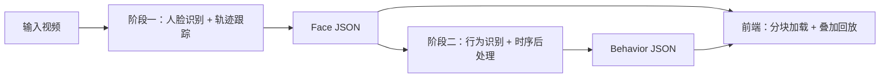

# 课堂行为分析系统研究报告

**题目**：课堂行为分析系统：两阶段人脸—轨迹—零样本行为识别流水线与可解释可视化实现  
**作者**：Classroom Behavior Analysis 项目组  
**日期**：2025-12-31  

---

## 摘要
本报告面向真实课堂监控视频场景，系统性总结了一套离线课堂行为分析系统的研究与实现。针对课堂场景中人脸遮挡、身份抖动及动作语义不贴合等挑战，系统采用“两阶段解耦”架构：第一阶段聚焦高鲁棒性的人脸检测与轨迹跟踪，生成稳定的身份轨迹；第二阶段在稳定身份约束下，利用预训练视频模型或零样本 CLIP 模型进行行为识别，并通过时序平滑与多模态优化输出按学生聚合的行为统计。报告详细阐述了从检测跟踪优化、身份稳定策略到行为推理增强的全链路技术方案，并提供了完整的代码实现与实验验证。

**关键词**：课堂行为分析；人脸识别；多目标跟踪；身份锁定；CLIP；零样本学习；时序平滑；可视化

---

## 1 引言
课堂行为分析同时具有工程挑战与研究价值。与短时动作识别不同，课堂场景常呈现：小人脸与遮挡、长时序统计对主体一致性的强依赖、动作语义域不匹配以及可解释可追溯需求。单帧识别在低头/遮挡场景中会间歇失效，导致身份抖动，使得“按学生聚合的行为占比/分段”不再可信。另一方面，通用动作识别模型在课堂中易输出语义不贴合类别，难以支撑教学评估的解释性要求。

为此，本项目以“身份稳定优先”为原则，采用两阶段解耦流水线：先生成稳定身份轨迹，再在稳定主体条件下做行为识别，并通过前端将检测框、时间线与推理分数统一呈现，形成可追溯证据链。

---

## 2 系统概述与数据流

### 2.1 核心架构
系统采用“两阶段解耦”架构，旨在解决复杂课堂场景下的行为分析难题：
- **阶段一（Phase 1）**：对输入视频执行人脸识别与轨迹跟踪。通过身份锁定/切换检测与身体框辅助回退跟踪，生成包含轨迹历史与锁定状态的结构化输出信息。
- **阶段二（Phase 2）**：在稳定身份约束下从原视频裁剪动作片段。使用 Kinetics 预训练视频模型或 CLIP 零样本模型进行行为识别，并通过时序平滑与不确定性门控输出按学生聚合的行为统计，同时可输出逐帧推理调试轨迹供前端展示。

### 2.2 关键特性与优化策略
针对课堂场景的具体挑战，系统在多个层面实现了深度优化：

1.  **检测与跟踪增强**：
    - 针对小脸问题，采用 **平铺检测 (Tiled Detection) + IoU-NMS 去重** 策略提升召回率。
    - 针对遮挡与低头场景，引入 **两阶段匹配与 Body-only 回退** 机制，显著提升轨迹连续性。
    - 采用 **在线聚合 Embedding** 减少轨迹合并开销，并基于 **滞回策略 (Hysteresis)** 进行身份锁定/解锁，有效降低身份抖动。

2.  **行为推理与语义对齐**：
    - 在裁剪框层面引入 **“身体框优先”的三层策略**：优先使用人脸识别输出的人物框 `body_bbox` → 其次尝试 YOLO person 检测框匹配 → 最后回退至人脸框扩展。
    - 对 YOLO 进行 **“学生上下文框”迁移学习微调**，使其包含桌面/设备信息，从而提高 `using_device` 等类别的可观测性。
    - CLIP 模型侧通过 **多提示语聚合** 与 **GPU 端批量预处理/一次性帧编码** 提升语义鲁棒性与吞吐量。
    - 提供基于标注数据的 **校准脚本与参数搜索报告** ，用于迭代优化提示词、温度与门控阈值。

3.  **数据工程与可视化**：
    - 前端（基于 React + Vite + Recharts）采用 **Manifest + Chunk 分块加载** 技术，实现小时级 JSON 数据的流畅回放与联动分析，解决浏览器加载瓶颈。

### 2.3 数据流与入口
阶段一入口为 [video_recognizer.py](https://github.com/James-Leong/classroom-behavior-analysis/blob/main/video_recognizer.py)，核心在 [recognizer.py](https://github.com/James-Leong/classroom-behavior-analysis/blob/main/src/video/recognizer.py) 与 [tracker.py](https://github.com/James-Leong/classroom-behavior-analysis/blob/main/src/video/tracker.py)。阶段二入口为 [behavior_analyzer.py](https://github.com/James-Leong/classroom-behavior-analysis/blob/main/behavior_analyzer.py)，核心在 [pipeline.py](https://github.com/James-Leong/classroom-behavior-analysis/blob/main/src/behavior/pipeline.py)。演示前端位于 [fronts/](https://github.com/James-Leong/classroom-behavior-analysis/blob/main/fronts/)。



---

## 3 方法

### 3.1 阶段一：人脸识别与小脸召回增强
阶段一的人脸识别以 InsightFace 为主链路，并引入平铺检测（tile）以提升密集小脸召回。平铺检测后使用 IoU-NMS 去重，避免跨 tile 重复框带来的“同一人多框”问题。对应实现见：
- 平铺检测：[recognizer.py:_detect_faces_insightface_tiled](https://github.com/James-Leong/classroom-behavior-analysis/blob/main/src/face/recognizer.py#L494-L623)
- IoU-NMS 去重：[recognizer.py:_dedupe_faces_nms](https://github.com/James-Leong/classroom-behavior-analysis/blob/main/src/face/recognizer.py#L625-L673)

### 3.2 阶段一：轨迹跟踪与 body-only 回退
课堂场景的关键问题是“脸缺失但人仍在”。系统在跟踪阶段引入 Phase 2 的 body bbox 回退，以维持轨迹连续性。

**算法 1：Body-only 回退跟踪（伪代码）**

```text
Input: tracks T, face detections D, person detections P
1. Phase1: match D to T (IoU + appearance + motion)
2. For each track t not matched:
3.   if t.lost >= 2 and t.last_body_bbox exists:
4.     p* = argmax_{p in P, not assigned} IoU(t.last_body_bbox, p.bbox)
5.     if IoU >= body_iou_threshold:
6.        set t.body_only_tracking = True
7.        append placeholder face fields for this frame
8.        update t.last_body_bbox and reset lost counter
Output: updated tracks
```

**原始代码片段（实现证据）**：见 [tracker.py:L302-L367](https://github.com/James-Leong/classroom-behavior-analysis/blob/main/src/video/tracker.py#L302-L367)

```python
if body_bboxes:
    for tid, info in list(self.tracks.items()):
        if tid in tracks_matched_in_phase1:
            continue
        if info["lost"] >= 2 and info["lost"] <= self.max_lost:
            tracklet = info["tracklet"]
            if tracklet.last_body_bbox is None:
                continue
            ...
            if best_body_idx >= 0 and best_body_iou >= self.body_iou_threshold:
                tracklet.body_only_tracking = True
                tracklet.last_body_bbox = body_bbox
                info["lost"] = 0
                tracklet.frame_indices.append(int(frame_idx))
                tracklet.bboxes.append([0, 0, 0, 0])
                tracklet.identities.append("未知")
                tracklet.body_bboxes.append([int(x) for x in body_bbox])
```

#### 3.2.1 行为裁剪框的三层优先策略（Body bbox / Person bbox / Face fallback）
行为识别对“裁剪区域是否包含关键上下文（双手、桌面、手机/电脑）”高度敏感。为此，本项目在阶段二裁剪策略中显式引入三层优先级（但其设计动机与阶段一身体框能力强相关，因此在方法部分一并阐述）：

1) **优先使用 Face JSON 中的 `body_bbox`**（阶段一可由 person 检测器生成并写回，或由已有 body 框直接提供）  
2) 若缺失 `body_bbox`，则运行 YOLO person 检测并将 face 与 person 框进行匹配（见 3.2.2）  
3) 若仍失败，则将 face bbox 按启发式规则扩大为上半身裁剪框（fallback expansion）

该策略的直接实现位于行为流水线的裁剪框选择逻辑（见 [pipeline.py:L341-L370](https://github.com/James-Leong/classroom-behavior-analysis/blob/main/src/behavior/pipeline.py#L341-L370)）：

```python
# Priority 1: Use body_bbox from JSON (v2 schema)
crop_bbox = det.get("body_bbox")

# Priority 2: If no body_bbox in JSON, try person detector (fallback)
if crop_bbox is None and person_detector is not None:
    persons = person_detector.detect_persons(key_bgr, conf=cfg.person_conf)
    if persons:
        crop_bbox = pick_person_bbox_for_face(persons, face_bbox)

# Priority 3: If still no body bbox, use face bbox as fallback
if crop_bbox is None:
    x1, y1, x2, y2 = face_bbox
    h, w = key_bgr.shape[:2]
    fw = x2 - x1
    fh = y2 - y1
    cx = (x1 + x2) / 2
    bw = fw * 2.0
    bh = fh * 3.0
    bx1 = max(0, int(cx - bw / 2))
    by1 = max(0, int(y1 - fh * 0.2))
    bx2 = min(w, int(cx + bw / 2))
    by2 = min(h, int(by1 + bh))
    crop_bbox = [bx1, by1, bx2, by2]
```

从“系统工程贡献”角度，这一三层策略将身体框能力与行为识别性能绑定为可解释的因果链：当 `using_device` 等类别误判时，首先检查裁剪框是否覆盖桌面/设备，再决定是“检测器问题（需要微调）”还是“提示词/门控问题（需要校准）”。

#### 3.2.2 Face→Person 匹配：点-框距离约束与覆盖率权衡
在优先级策略的第二层中，系统需要将“人脸框”关联到“person 检测框”，以避免误把相邻学生的身体框用于当前学生。项目实现了一个轻量的匹配器 `pick_person_bbox_for_face`（见 [person_detector.py](https://github.com/James-Leong/classroom-behavior-analysis/blob/main/src/behavior/person_detector.py#L60-L108)）：

- 以人脸中心点为查询点，计算其到候选 person 框的点-矩形距离  
- 使用“水平松弛窗口”提高召回（适配教室密集座位），并用“归一化距离阈值”拒绝过远匹配

**算法 1b：Face→Person 匹配（伪代码）**

```text
Input: face bbox f, person boxes {p_i}
1. compute face center c
2. filter out p_i whose x-range is too far from c (relaxed overlap window)
3. choose p* with minimal point-rect distance^2(c, p_i)
4. if distance^2 / diag(p*)^2 > threshold: return None
5. else return p*.bbox
```

**原始代码片段（实现证据）**：

```python
def pick_person_bbox_for_face(persons, face_bbox):
    x1, y1, x2, y2 = [float(x) for x in face_bbox]
    cx = (x1 + x2) * 0.5
    cy = (y1 + y2) * 0.5

    def _point_rect_dist2(px1, py1, px2, py2):
        dx = 0.0
        if cx < px1:
            dx = px1 - cx
        elif cx > px2:
            dx = cx - px2
        dy = 0.0
        if cy < py1:
            dy = py1 - cy
        elif cy > py2:
            dy = cy - py2
        return dx * dx + dy * dy

    for p in persons:
        px1, py1, px2, py2 = [float(x) for x in p.bbox]
        if cx < px1 - 0.5 * (px2 - px1) or cx > px2 + 0.5 * (px2 - px1):
            continue
        d2 = _point_rect_dist2(px1, py1, px2, py2)
        ...
    diag2 = max(1.0, (px2 - px1) ** 2 + (py2 - py1) ** 2)
    if float(best_d2) / diag2 > 0.35:
        return None
    return best_bbox
```

该匹配器的设计体现了“高召回优先”的课堂偏好：宁可在第二层命中更多候选，再由第三层/门控/平滑抑制误报，也不希望裁剪框频繁退化为 face-only 扩展（因为会丢失桌面/设备上下文）。

#### 3.2.3 身体框识别与 YOLO 上下文微调：从 tight person 到 student_context
仅依赖 COCO `person` 类的 tight bbox，往往无法覆盖桌面与设备，导致 CLIP 看到的裁剪片段缺少“手机/电脑”等关键物体，进而将 `using_device` 误判为 `reading_or_writing` 或 `listening`。为此，本项目将“身体框识别”扩展为“学生上下文框（student_context）”，并提供从抽帧、预标注、标注到微调训练的完整工具链（文档：[YOLO_finetune_for_context.md](https://github.com/James-Leong/classroom-behavior-analysis/blob/main/docs/YOLO_finetune_for_context.md)）。

核心思想是迁移学习：保持预训练 backbone，替换检测 head，使模型输出单类 `student_context`，其标注原则要求框覆盖“学生上身+双手+桌面交互对象（书本/手机/笔记本电脑）”。工具链包括：

- 抽帧与预标注：`scripts/prepare_yolo_data.py`（生成 YOLO 数据集与 Label Studio 任务；见 [prepare_yolo_data.py](https://github.com/James-Leong/classroom-behavior-analysis/blob/main/scripts/prepare_yolo_data.py#L22-L113)）  
- 训练微调：`scripts/train_yolo_finetune.py`（调用 ultralytics YOLO API；见 [train_yolo_finetune.py](https://github.com/James-Leong/classroom-behavior-analysis/blob/main/scripts/train_yolo_finetune.py#L12-L45)）  
- 推理集成：通过 `BehaviorPipelineConfig.person_detector_weights` 或命令行 `--person-detector` 指向 `models/<name>/weights/best.pt`（文档说明见 [YOLO_finetune_for_context.md](https://github.com/James-Leong/classroom-behavior-analysis/blob/main/docs/YOLO_finetune_for_context.md#L60-L70)）

**原始代码片段（数据准备：只保留 person 类并构建单类数据集）**：

```python
# scripts/prepare_yolo_data.py
for box in results.boxes:
    cls_id = int(box.cls[0])
    if cls_id != 0:
        continue
    xywhn = box.xywhn[0].tolist()
    f.write(f"0 {xywhn[0]:.6f} {xywhn[1]:.6f} {xywhn[2]:.6f} {xywhn[3]:.6f}\n")

dataset_yaml = {"nc": 1, "names": ["student_context"], ...}
```

**原始代码片段（训练微调：替换 head 并输出 best.pt）**：

```python
# scripts/train_yolo_finetune.py
model = YOLO(args.model)
results = model.train(
    data=args.data,
    epochs=args.epochs,
    imgsz=640,
    batch=args.batch,
    device=device,
    project="models",
    name=args.name,
)
```

该“上下文身体框”的引入构成了本项目重要的跨模块优化：它把“检测框质量”作为影响 CLIP 行为判别的关键变量，通过少量标注与迁移学习显著提升 `using_device` 的可观测性，从而提升整体行为识别可用性。

#### 3.2.4 在线聚合 embedding 与轨迹合并：降低长视频身份维护开销
长视频中同一学生会产生大量 embedding。若在每次相似性比较/轨迹合并时都对全历史 embedding 做堆叠与平均，将带来显著计算与内存开销。为此，系统在 `Tracklet` 内维护“在线聚合 embedding（quality-weighted mean）”，并在合并阶段优先使用该状态，避免反复 `np.stack`。

**算法 1c：在线聚合 embedding（伪代码）**

```text
Input per detection: embedding e, quality q
1. normalize e
2. w = clamp(q, 0.05, 1.0)
3. if agg is None: agg = e; W = w
4. else:
     agg = normalize((agg*W + e*w)/(W+w))
     W = W + w
Output: agg_embedding, agg_weight
```

**原始代码片段（在线聚合更新）**：见 [tracker.py:L76-L123](https://github.com/James-Leong/classroom-behavior-analysis/blob/main/src/video/tracker.py#L76-L123)

```python
w = float(max(0.05, min(1.0, quality)))
if self.agg_embedding is None or self.agg_weight <= 0.0:
    self.agg_embedding = emb
    self.agg_weight = w
else:
    agg = (self.agg_embedding * float(self.agg_weight) + emb * w) / (float(self.agg_weight) + w)
    n2 = float(np.linalg.norm(agg))
    if n2 > 1e-12:
        agg = agg / n2
    self.agg_embedding = agg
    self.agg_weight = float(self.agg_weight) + w
```

在轨迹合并 `merge_similar_tracks` 中，系统直接取 `agg_embedding` 做余弦相似度比较，并在合并后同步合并聚合状态（见 [tracker.py:L460-L551](https://github.com/James-Leong/classroom-behavior-analysis/blob/main/src/video/tracker.py#L460-L551)）。该优化使得“身份维护”可以在小时级视频中以近似常数代价增量更新，为后续的锁定/切换检测提供稳定表征。

### 3.3 阶段一：身份稳定（多帧强化 + 滞回锁定/解锁 + 切换检测）
系统将身份由“逐帧分类”提升为“轨迹状态机”。核心逻辑在：
- 多帧强化 re-id：[recognizer.py:_refresh_track_identities](https://github.com/James-Leong/classroom-behavior-analysis/blob/main/src/video/recognizer.py#L221-L247)
- 滞回锁定/解锁与切换检测：[recognizer.py:_apply_identity_hysteresis](https://github.com/James-Leong/classroom-behavior-analysis/blob/main/src/video/recognizer.py#L248-L419)

**算法 2：身份滞回状态机（伪代码）**

```text
State per track: locked_identity, lock_evidence, switch_evidence, unknown_streak
Input per frame: cand_identity, cand_similarity, body_only_tracking
If not locked:
  if cand!=unknown and sim>=lock_threshold: lock_evidence++ else lock_evidence=0
  if lock_evidence>=lock_min_frames: lock
Else locked:
  if cand==locked: reset switch_evidence/unknown_streak
  elif cand==unknown:
       if not body_only_tracking: unknown_streak++ and accumulate unlock evidence
  else cand is another known identity:
       if not body_only_tracking: accumulate switch evidence
       if switch_evidence>=switch_min_frames:
            if cos_sim(locked_embedding, agg_embedding) < tau: treat as true switch
            update locked_identity and lock_history
If unlock conditions satisfied: unlock
Output: display_identity, is_locked
```

**原始代码片段（body-only 冻结证据）**：见 [recognizer.py:L333-L351](https://github.com/James-Leong/classroom-behavior-analysis/blob/main/src/video/recognizer.py#L333-L351)

```python
elif cand == "未知":
    if not body_only_tracking:
        unk += 1
        if unk >= int(eff_hold_unknown_frames) and sim < float(eff_unlock_threshold):
            sw_ev += 1
        else:
            sw_ev = 0
...
else:
    unk = 0
    if not body_only_tracking:
        if sim >= float(switch_threshold):
            sw_ev += 1
        else:
            sw_ev = 0
```

### 3.4 阶段二：CLIP 零样本行为识别与批量推理优化
阶段二在稳定身份前提下，对每个学生按时间采样裁剪 clip，并推理行为标签。系统同时支持 Kinetics 与 CLIP，其中 CLIP 方案强调类别可控与语义贴合。

#### 3.4.1 CLIP 批量推理（一次性帧编码）
实现位于 [action_model_clip.py:_predict_batch_optimized](https://github.com/James-Leong/classroom-behavior-analysis/blob/main/src/behavior/action_model_clip.py#L268-L345)。

**算法 3：CLIP 批量推理（伪代码）**

```text
For each clip: preprocess frames -> tensor
Concat all clip frame tensors -> one big tensor
Encode all frames once -> features
Split features by clip and mean-pool over time
Compute softmax(temperature * video_feature @ text_features^T)
```

**原始代码片段（实现证据）**：见 [action_model_clip.py:L299-L327](https://github.com/James-Leong/classroom-behavior-analysis/blob/main/src/behavior/action_model_clip.py#L299-L327)

```python
all_frames_concat = torch.cat(all_frame_tensors, dim=0)
with torch.no_grad():
    all_features = self.model.encode_image(all_frames_concat)
    all_features = all_features / all_features.norm(dim=-1, keepdim=True)
...
video_features_batch = torch.cat(video_features_list, dim=0)
similarity = (float(self.temperature) * video_features_batch @ self.text_features.T).softmax(dim=-1)
```

#### 3.4.2 EMA 平滑与不确定性门控
pipeline 通过概率阈值与 top1-top2 边际（margin）执行门控，并对分数做 EMA 平滑（实现见 [pipeline.py:L404-L527](https://github.com/James-Leong/classroom-behavior-analysis/blob/main/src/behavior/pipeline.py#L404-L527)）。
```python
if min_prob > 0.0 and float(top1_prob) < min_prob:
    gated = True
if min_margin > 0.0 and float(margin) < min_margin:
    gated = True
...
st[lbl] = prev * alpha + float(v) * (1.0 - alpha)
...
if gated:
    chosen_label = str(prev_lbl) if had_history and prev_lbl else _pick_conservative_label(cur_scores)
else:
    chosen_label = max(st.items(), key=lambda kv: float(kv[1]))[0] if st else top1_label
```

### 3.5 基于标注的 CLIP 校准：从“提示词/参数/门控”到可量化迭代
本项目并未将 CLIP 仅作为“开箱即用”的零样本模块，而是建立了“标注→评估→定位混淆→迭代提示词/裁剪/阈值→再评估”的校准闭环（参见 [CLIP_USAGE.md](https://github.com/James-Leong/classroom-behavior-analysis/blob/main/docs/CLIP_USAGE.md#L148-L213)）。

#### 3.5.1 标注数据组织：manifest.jsonl
推荐采用 JSONL（每行一个样本）记录“中心帧 + 裁剪框 + 人工标签”，其字段与后续校准脚本直接对齐：

- `video_path`：原视频路径  
- `frame`：中心帧  
- `crop_bbox_xyxy`：用于行为识别的裁剪框  
- `annotator_label`：人工细粒度标签（fine）  
- `target_label`：系统当前策略下的候选标签（可选，但有助于统计纠偏量）  
- `track_is_locked/student_id/quality/similarity`：可选字段，用于过滤与误差分析

#### 3.5.2 细标签→粗标签映射与可比较性
为使人工标注与 CLIP 输出的粗标签空间可比较，脚本内置默认映射（见 [calibrate_from_annotations.py:L87-L98](https://github.com/James-Leong/classroom-behavior-analysis/blob/main/scripts/calibrate_from_annotations.py#L87-L98)）：

`listening_upright→listening`，`on_task_head_down→reading_or_writing`，`off_task→distracted`，`using_device→using_device` 等。该映射将“课堂业务细标签”统一到模型可输出的“粗标签集合”，使得混淆矩阵与宏 F1 等指标可解释。

#### 3.5.3 校准脚本：heuristic vs clip 两种评估模式
项目提供校准脚本 [calibrate_from_annotations.py](https://github.com/James-Leong/classroom-behavior-analysis/blob/main/scripts/calibrate_from_annotations.py)：

- `mode=heuristic`：比较 `target_label` 与 `annotator_label` 的差异，评估“当前规则/策略”在标注集上的一致性  
- `mode=clip`：在给定 `video_path + frame + crop_bbox_xyxy` 的条件下重跑 CLIP 推理，得到 coarse 预测并与人工 coarse 对比  
- `mode=both`：同时输出两类报告

其核心实现包括：

1) 读取 JSONL、过滤样本并累积混淆矩阵（见 [calibrate_from_annotations.py:L165-L191](https://github.com/James-Leong/classroom-behavior-analysis/blob/main/scripts/calibrate_from_annotations.py#L165-L191)）  
2) 在 clip 模式下对每个样本采样动作片段、裁剪并推理（见 [calibrate_from_annotations.py:L110-L137](https://github.com/James-Leong/classroom-behavior-analysis/blob/main/scripts/calibrate_from_annotations.py#L110-L137)）

```python
def _predict_clip_coarse(model, cap, *, frame, crop_bbox_xyxy, fps, max_frame, clip_seconds, num_frames):
    indices = sample_frame_indices(center_frame=frame, fps=fps, window_seconds=clip_seconds, num_frames=num_frames)
    frames_bgr = read_frames_by_index(cap, indices)
    clip_rgb = crop_clip(frames_bgr, crop_bbox_xyxy)
    scores, _ = model.predict_proba(clip_rgb, topk=0)
    pred = max(scores.items(), key=lambda kv: float(kv[1]))[0]
    return pred, scores
```

#### 3.5.4 参数搜索与门控阈值优化（证据：calibration_search_report）
除“提示词迭代”外，本项目还对 `temperature`、`smooth_alpha`、`uncertain_min_prob/margin`、`distracted_enter/stay` 等参数进行搜索，并输出可复现的搜索报告：

- `outputs/calibration_report.json`：给定参数下的混淆矩阵、top1 概率与 margin 分布统计（例如 n=15、accuracy=0.533 的小样本校准；见 `calibration_report.json`）  
- `outputs/calibration_search_report.json`：给定目标函数下的 top-k 参数组合（见 `calibration_search_report.json`）

该部分工作使得“CLIP 优化”从经验调参转向“以标注集为依据的可量化迭代”，与 3.2.3 的检测器微调共同构成“数据驱动的端到端提升”路径：检测器提升裁剪可观测性，校准脚本提升提示词与门控策略的可解释可复现性。

---

## 4 前端可视化与数据工程
前端模块仅用于离线结果的演示与复核，不作为本研究的主要贡献点。其作用是把阶段一/阶段二产物组织为“可追溯证据链”：

- 输入：`outputs/face_results_*.json`（包含 `body_bbox`、`track_is_locked`、`lock_history` 等）、`outputs/behavior_*.json`、以及可选的 `outputs/debug_trace.json`  
- 展示：视频叠加（人脸/身体框与身份）、按学生的行为时间线/分段统计、以及不确定性门控与平滑前后对比（用于研究迭代的误差定位）

本报告在结果展示部分（5.5）以“前端页面截图占位 + 文字说明”给出统一呈现模板，便于后续用实际截图替换并形成最终论文图表。

---

## 5 实验与结果
### 5.1 CLIP vs Kinetics：类别空间与课堂语义贴合性
项目在 `CLIP_vs_Kinetics_comparison.md` 中给出 CLIP 与 Kinetics 的对比实验：在同一段 15 秒视频上，CLIP（ViT-B/32, subsample=4）耗时 245.78s，Kinetics（r3d_18）耗时 394.06s，CLIP 在该配置下更快约 60%。更关键的是，CLIP 的预测类别由提示语定义，天然受课堂语义约束，而 Kinetics 的固定类别空间更易出现语义不贴合行为，解释性较差。

### 5.2 标注驱动的校准报告：混淆对与不确定性分布
本项目保留了校准报告 `calibration_report.json` 作为“标注→评估→迭代”的证据。该报告在 n=15 的样本上得到 accuracy=0.533（8/15），并给出混淆矩阵与不确定性分布（top1_prob 与 margin 的分位数）。从混淆矩阵可见，主要错误集中在 `listening` 与 `reading_or_writing` 的边界（`listening` 被预测为 `reading_or_writing` 计 4 次），这与课堂中“抬头听讲 vs 低头读写”的视觉差异在低分辨率下易混淆相一致。

为了将该观察转化为可操作的优化路径，本项目把错误归因拆解为两类可验证假设：

1) 裁剪框是否覆盖了决定性上下文（桌面/笔/书/手机），若否优先改进身体框（见 3.2.1–3.2.3）  
2) 在裁剪框可观测的前提下，是否需要通过提示词与门控阈值把“边界样本”压回更保守标签（见 3.5）

### 5.3 参数搜索报告：门控/平滑阈值的目标函数优化
除单点评估外，本项目还对门控与平滑参数进行了搜索，并输出 `calibration_search_report.json`。该报告定义目标函数：

```text
score = accuracy + 0.5*listening_recall + 0.3*distracted_recall
```

并给出 best/top-k 参数组合（例如 `temperature=40.0, smooth_alpha=0.8, distracted_enter_min_margin=0.25` 等）。该结果体现了本项目的研究取向：不是单纯追求 overall accuracy，而是把“课堂最关键行为（如听讲/分心）”的召回纳入优化目标，从而与教学应用需求对齐。

### 5.4 身体框微调的验证思路：从“可观测性”到“using_device”改进
本项目提供了 YOLO “学生上下文框（student_context）”微调方案（见 3.2.3），其预期收益并非直接提升检测 mAP 本身，而是提升“行为识别输入的可观测性”：让裁剪片段更稳定地包含桌面与设备，从而减少 `using_device` 被误判为 `reading_or_writing` 的情况。验证方式建议采用“同一 Face JSON + 同一视频 + 不同 person_detector_weights”做对照试验，比较 `using_device` 的召回、以及 `listening`/`reading_or_writing` 的混淆是否下降（见 [YOLO_finetune_for_context.md](https://github.com/James-Leong/classroom-behavior-analysis/blob/main/docs/YOLO_finetune_for_context.md#L56-L69) 的评估建议）。

### 5.5 最终行为识别结果展示
本节将“最终展示物”按论文常见图表规范组织为两部分：图片展示与文字说明。图片为前端页面截图（此处先以相对路径占位，后续可用真实截图替换）。

#### 5.5.1 图片展示
- 图 5-1 班级总览页：学生列表、总体行为占比、关键片段入口  
  

- 图 5-2 学生详情页：行为时间线、分段列表、点击跳转到视频时间点  
  

- 图 5-3 学生详情页的实时推理面板（EMA）：展示 EMA 平滑后的各行为概率（用于解释最终标签与门控/平滑效果）  
  

#### 5.5.2 结果分析
结合图 5-1～图 5-3，可以将本系统的“最终结果”理解为一条从总体统计到单人证据的可追溯链路。

图 5-1（班级总览）用于回答“全班层面发生了什么”：左侧为学生列表（可切换到单个学生视角），主体区域以堆叠条形图汇总各学生在不同标签下的累计时长，从而快速定位异常模式（例如个别学生 `distracted/using_device` 占比显著更高）。

图 5-2（学生详情页）用于回答“该学生在时间轴上何时发生了什么”：页面以视频回放为主体，并配合行为时间线展示分段结果；用户可通过时间线/分段定位到具体时间点，并在视频回放中对照课堂语境完成复核。

图 5-3（实时推理面板 EMA）用于回答“为什么最终标签是这个”：面板展示每一类行为的 EMA 平滑分数（按分数排序并以百分比条形显示），直观反映模型在当前时刻对各标签的相对置信度；当出现短时抖动或边界样本时，EMA 的平滑效果使得“最终展示标签”更稳定，便于与门控策略一起解释最终输出。

---

## 6 讨论与局限
1) 身份切换检测路径中存在“需要分割但暂未实现”的逻辑（见 [recognizer.py:L373-L377](https://github.com/James-Leong/classroom-behavior-analysis/blob/main/src/video/recognizer.py#L373-L377)）。后续可实现轨迹分割以形成更严格的主体一致性约束。  
2) CLIP 零样本无需训练，但对提示语与裁剪框质量敏感。建议采用标注驱动的校准流程（见 [CLIP_USAGE.md](https://github.com/James-Leong/classroom-behavior-analysis/blob/main/docs/CLIP_USAGE.md)）。  
3) 课堂视频与人脸属于敏感数据，真实部署需遵循授权、最小化存储、访问控制与审计机制。
---

## 7 结论
本研究实现了一套面向课堂场景的端到端行为分析系统，并在检测、跟踪、身份稳定、行为识别与可视化数据工程多个层面给出可复现的优化方案。两阶段解耦保证身份策略与行为模型可独立迭代；body-only 回退提升遮挡/低头场景轨迹连续性；滞回锁定降低身份抖动；CLIP 零样本与批量推理优化提升语义贴合与吞吐；前端分块加载将小时级结果转化为可交互、可解释的分析界面。

---

## 参考文献
[1] Radford A., et al. Learning Transferable Visual Models From Natural Language Supervision (CLIP). 2021.  
[2] Deng J., et al. ArcFace: Additive Angular Margin Loss for Deep Face Recognition. 2019.  
[3] Wojke N., Bewley A., Paulus D. Simple Online and Realtime Tracking with a Deep Association Metric (DeepSORT). 2017.  
[4] Ultralytics. YOLO (Ultralytics). 2023–2025.  
[5] Brown R. G. Exponential Smoothing for Predicting Demand. 1959.  
